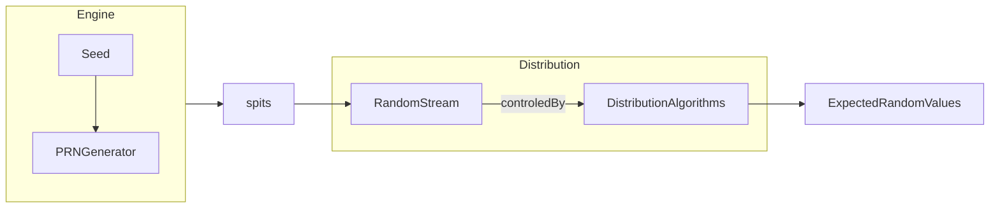

# C++11 has random library
Theory
In C we use random like 
```c
srand(SEED);
int x = rand()%20;
```
This will generate random between 1 to 20. 
So for typical random situation we Have 




2 concepts
1. Random Engine : Combination of Device Seed and Generator , Spits Random Number
2. Distribution  : Control Random Number with Distribution Algorithms (Uniform, Poisson, Bernoulli etc...)

Usage:
1. Create Seed Device and Attach proper Generator
```cpp
random_device deviceSeed;
mt19937 generator(deviceSeed);
```
2. Create Distribution
```cpp
uniform_int_distribution<> distribution(1,100);
```
3. Using  distributor(generator()) to get proper random variables
```cpp
int randVal = distribution(generator());

//gives random 1 to 20
std::vector<int> vi(20);
std::generate(vi.begin(), vi.end(), [&generator, &distribution](){return distribution(generator());});
```