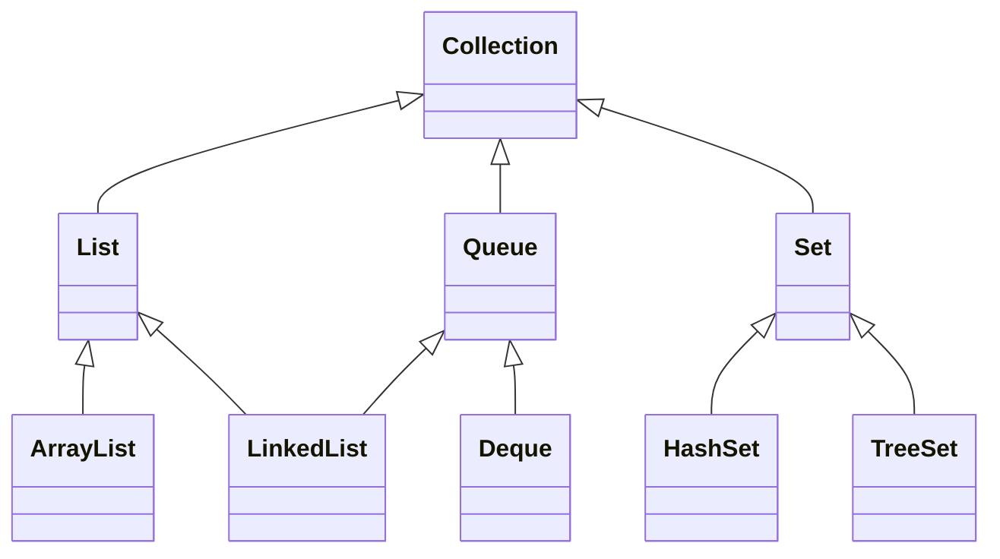
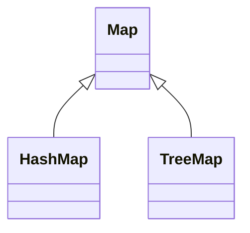

#  Collection

## Interfaces

| Interface | Methods                          |
| --------- | -------------------------------- |
| Iterator  | hasNext, next, remove            |
| Iterable  | iterator, splitIterator, forEach | 

## Classes

## Collection common Operations
1. add
2. remove
3. isEmpty, size
4. clear
5. contains
6. removeIf(lambdafn)
7. forEach, for(el:cl), iterator
8. equals

