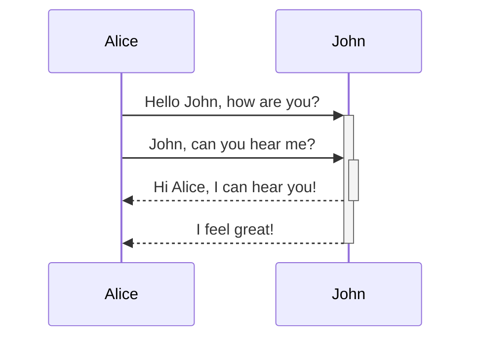
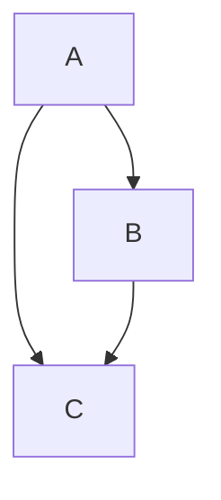
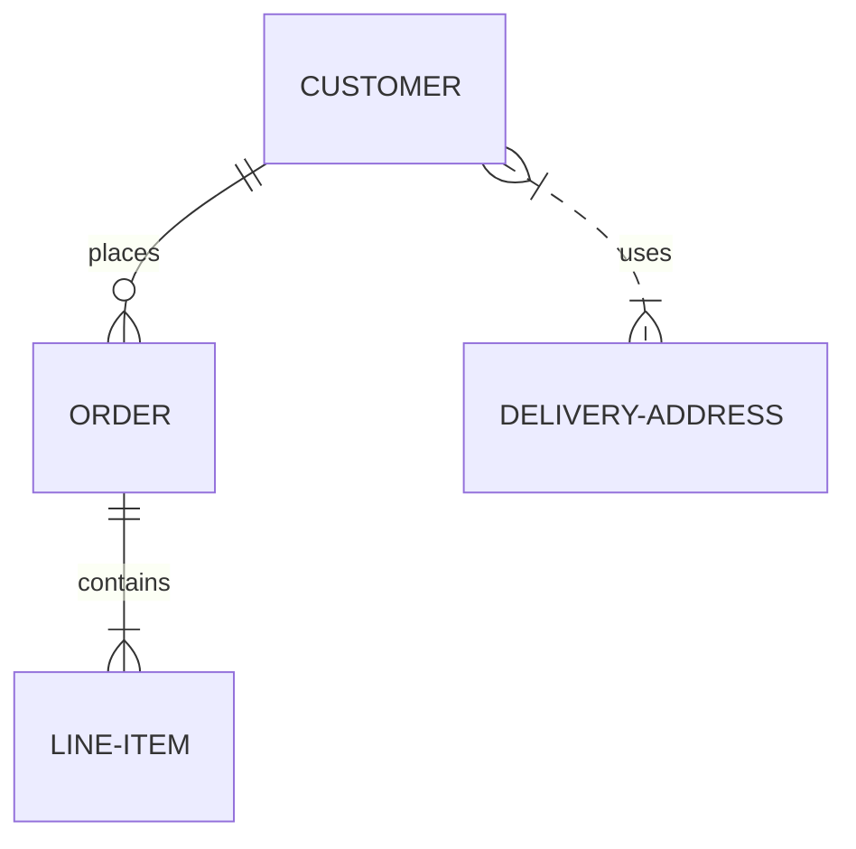
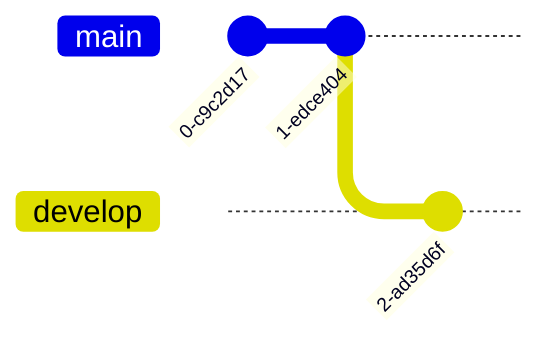

# Mermaid diagram  

```mermaid
sequenceDiagram
    Alice->>+John: Hello John, how are you?
    Alice->>+John: John, can you hear me?
    John-->>-Alice: Hi Alice, I can hear you!
    John-->>-Alice: I feel great!
```

```mermaid
graph TD;
	A --> B;
	A --> C;
	B --> C;
```

```mermaid
erDiagram  
    CUSTOMER ||--o{ ORDER : places  
    ORDER ||--|{ LINE-ITEM : contains  
    CUSTOMER }|..|{ DELIVERY-ADDRESS : uses
```

```mermaid

gitGraph:
	commit
	commit
	branch develop
	commit
	
```