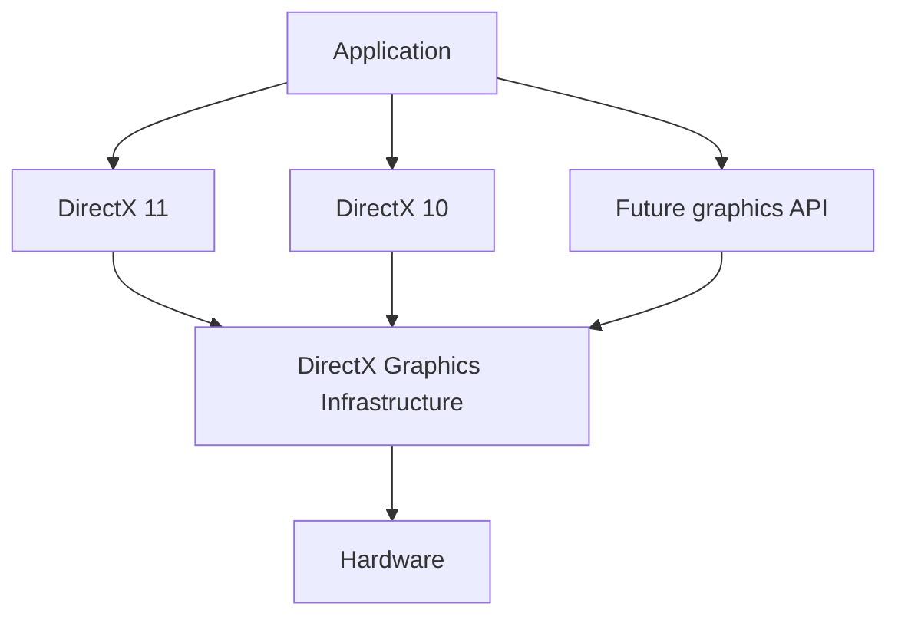

# DirectX11 Overview 
## Core Components
Need to Create 3 Components
1. Device (For setting up all resources GPU)
2. DeviceContext (For rendering)
	1. Create IA,VS,PS etc..
3. SwapChain (For Double buffering, Multisampling, VSync) (Monitor/GPU connection)

Stencil => நகல் எடுக்க உதவும் உள்வெட்டுத் தகடு

## Device and Device Context
### Device
The ID3D11Device interface provides many methods for creating shader program  objects, resources, state objects, and query objects (among others). It also provides methods for checking the availability of some hardware features, along with many diagnostic-  and debugging-related methods. In general, the device can be thought of as the provider of  the various resources that will be used in an application.

### Device Context
to actually  use those resources and manipulate the pipeline itself, we will use a device context. Device  contexts are used to bind the created resources, shader objects, and state objects to the pipeline. They are also used to control the execution of rendering and computation pipeline invocations. In addition, they provide methods for manipulating the resources created by the  device. 

In general, the device context can be thought of as the consumer of the resources  produced by the device, which serves as the interface for working with the pipeline.

##### Immediate Context
1. When a method is called  from this context, it is submitted immediately by the Direct3D 11 runtime for execution in  the driver. 
2. Only a single immediate context is allowed, and it is created at the same time  that the device is created. 
3. This context can be seen as the interface for directly interacting  with all of the components of the pipeline. This context must be used as the main rendering  thread, and serves as the primary interface to the GPU. 
 
##### Deferred Context
1. The deferred context is a secondary type of context that provides a thread-safe mechanism  for recording a series of commands from secondary threads other than the main rendering  thread. 
2. This is used to produce a command list object which can be “played” back on the immediate context at a later time. 
3. Allowing the command list to be generated from other threads  provides some potential that a performance improvement could be found on multi-core CPU  systems. 
4. In addition, Direct3D 11 also allows asynchronous resource creation to be carried  out on multiple threads, which provides the ability to simplify multithreaded loading situations.

### DxGI 
DirectX Graphics Infrastructure (DXGI) recognizes that some parts of graphics evolve more slowly than others. The primary goal of DXGI is to manage low-level tasks that can be independent of the DirectX graphics runtime. DXGI provides a common framework for future graphics components

previous versions of Direct3D, low-level tasks like enumeration of hardware devices, presenting rendered frames to an output, controlling gamma, and managing a full-screen transition were included in the Direct3D runtime. These tasks are now implemented in DXGI
```txt

Enumerating Adapters
	1. New info about enumerating adapters for Windows 8
Presentation
	1. Create a Swap Chain
	2. Care and Feeding of the Swap Chain
	3. Handling Window Resizing
	4. Choosing the DXGI Output and Size
	5. Debugging in Full-Screen Mode
	6. Destroying a Swap Chain
	7. Using a Rotated Monitor
	8. Switching Modes
	9. Full-Screen Performance Tip
	10. Multithread Considerations
```


DirectX 11 Overview
(https://www.milty.nl/grad_guide/basic_implementation/d3d11/index.html)

